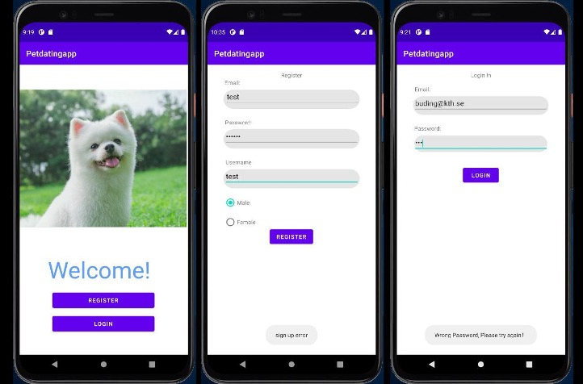
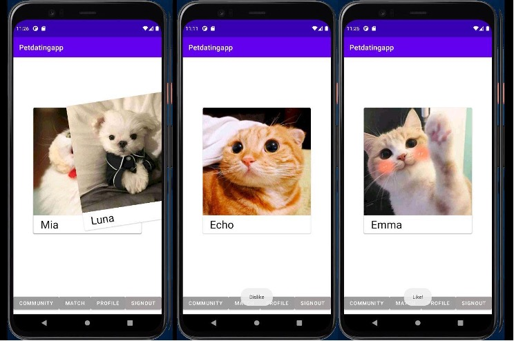
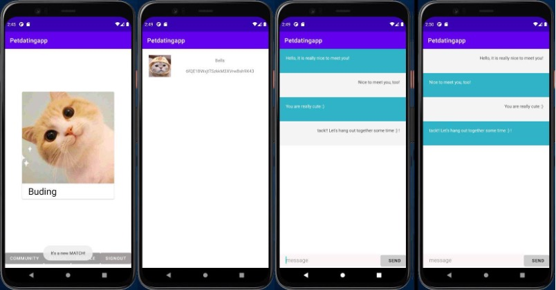
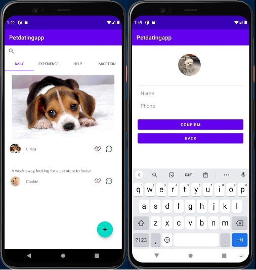

# ID2216Petdatingapp
This is my ID2216 Developing Mobile Applications Project. 
In this project, we propose to design a dating app for pets. We have basically implemented a pet dating native application utilizing Android Studio and Google's firebase platform. In contrast to the existing pet apps on the market, our application focuses more on pets rather than pet owners. We plan to provide human-like "dating" opportunities for pets, which is also very important. A community page was also added where you can share your pet's daily life, share experiences, ask for help, etc. In this application, we use authentication, a real-time database, and storage services. In addition, the basic functionality of page jumping has been implemented with different navigation bars and we use the bottom navigation bar to navigate to different goals of the application - community, match, profile, and logout.

